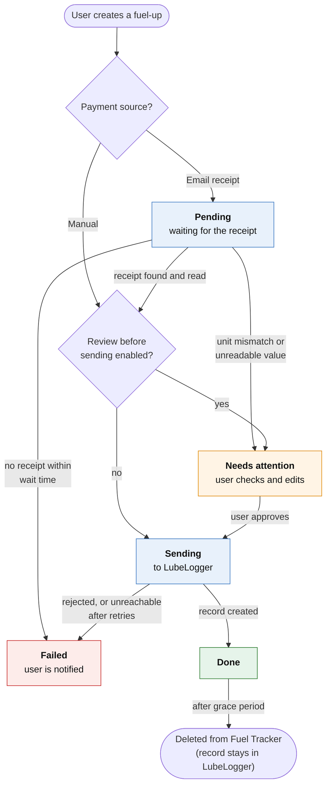

# Technical design

How Fuel Tracker is built. For what it does and why, see the
[project outline](../README.md).

## Overview

Fuel Tracker is a single Docker container:

```
                 ┌──────────────────── Docker container ─────────────────────┐
Browser / PWA ──►│  FastAPI                                                   │
Apple Shortcut ─►│   ├─ REST API (/api/...)        ◄── same API for both      │
                 │   ├─ Live updates (SSE)                                    │
                 │   ├─ Static web UI (built Vue app)                         │
                 │   └─ Background workers                                    │──► LubeLogger API
                 │        ├─ Mail watcher (IMAP IDLE) ◄────────────────────── │◄── MXroute (IMAP)
                 │        ├─ Fuel-up processor                                │
                 │        └─ Scheduler (timeouts, retries, cleanup)           │
                 │  SQLite database (/data volume)                            │
                 └────────────────────────────────────────────────────────────┘
```

Everything runs in one process. There is no separate worker container, message
queue or database server. At one fuel-up every few days, that is plenty, and it
keeps hosting simple.

## Stack

| Part | Choice | Why |
| --- | --- | --- |
| Language | Python 3.13 | FastAPI is Python; good libraries for IMAP and PDF |
| Backend | FastAPI | Async, typed request models, automatic OpenAPI docs (useful when building the Shortcut) |
| Database | SQLite via SQLAlchemy 2, migrations with Alembic | Single file in a volume, no extra container |
| Settings | pydantic-settings | Reads and validates environment variables |
| HTTP client | httpx | Async calls to the LubeLogger API |
| Mail | IMAPClient | Supports IMAP IDLE (push), folder moves and searches |
| PDF | pdfplumber | Text extraction plus access to the PDF metadata (creation date) |
| Passwords | argon2 (via pwdlib) | Current recommended password hashing |
| Notifications | Apprise (later) | One library for email, Pushover, ntfy, Telegram etc. |
| Web UI | Vue 3 + TypeScript, built with Vite | Component-based UI that updates in place; mature PWA support |
| PWA | vite-plugin-pwa | Manifest and service worker, so the UI can be installed on the phone later |
| Packaging | uv (Python), npm (UI), multi-stage Dockerfile | Reproducible builds; final image contains no Node.js |

## Web UI and live updates

The web UI is a single-page app (Vue) that only talks to the REST API, exactly
like the Shortcut does. FastAPI serves the built UI as static files, so it is
still one container and one URL.

Changes appear without a page reload through **Server-Sent Events (SSE)**:

- The UI opens one connection to `/api/events`.
- Whenever a fuel-up changes (status, receipt found, sent to LubeLogger), or
  an unmatched receipt or notification appears, the server sends a small event
  over it.
- The UI then reloads just the affected item from the API.

SSE is used instead of WebSockets because updates only flow from server to
browser. It is plain HTTP, reconnects automatically, and passes through reverse
proxies without special configuration (proxy buffering must be off for that
path; see [Deployment](#deployment)).

The UI is built as a PWA from the start (manifest, icons, service worker for
the app shell), so installing it on the phone later needs no rework. Data is
always loaded live; there is no offline mode.

## Data model

The database only holds what Fuel Tracker needs while it works. Finished
fuel-ups are deleted after the grace period; LubeLogger is the long-term store.

| Table | Contents |
| --- | --- |
| `users` | Username, optional email address (for notifications later), password hash, role (admin/user), active flag |
| `user_vehicles` | Which LubeLogger vehicle IDs a user may log for |
| `api_tokens` | Per-user tokens for the Shortcut (stored hashed), name, last used |
| `fuel_ups` | Vehicle, odometer, date/time, full/missed flags, GPS, payment source, manual payment data, status, warnings, error message, LubeLogger record ID once sent, created by, timestamps |
| `receipts` | Data extracted from a receipt (station, address, date/time, fuel type, quantity, unit, total, currency, transaction ID), the PDF file, the mail's message ID, linked fuel-up (if any), state (matched/unmatched/ignored) |
| `notifications` | Messages shown in the web UI (e.g. "Fuel-up failed"), read flag |
| `settings_overrides` | Settings changed in the web UI (see [Settings](#settings)) |

Receipt PDFs are stored as files under `/data/receipts/` only until they have
been uploaded to LubeLogger, and are deleted with the fuel-up.

## Fuel-up lifecycle



Colored boxes are the statuses a fuel-up can have. *Sending* is an internal
status; the UI shows it as Pending.

From **Failed**, the user can recover the fuel-up in three ways (left out of
the diagram to keep it readable):

- **Retry receipt search**: back to Pending, with a new wait time
- **Enter payment data manually**: continues at the review question
- **Retry sending**: back to Sending, for LubeLogger errors

A fuel-up can be edited in every status except Sending and Done.

Sending to LubeLogger, in order:

1. Check the odometer is still not lower than the last reading (another record
   may have been added in LubeLogger meanwhile).
2. For receipts: check the transaction ID isn't already in any fuel record's
   notes (`GET /api/vehicle/gasrecords/all`).
3. Upload the PDF (`POST /api/documents/upload`).
4. Create the fuel record (`POST /api/vehicle/gasrecords/add`) with notes,
   extra fields and the uploaded file.
5. Mark the fuel-up Done.

Network errors and 5xx responses from LubeLogger are retried with increasing
delays (e.g. 1, 5, 15 minutes). A 4xx response (rejected data) fails
immediately, because retrying won't help.

## Mail handling

The mail watcher keeps one IMAP connection to the MXroute inbox:

1. **On start-up**: scan the inbox for receipt emails not yet processed.
2. **Then**: wait with IMAP IDLE. MXroute's mail server (Dovecot) supports it,
   so new mail is announced within seconds. The connection is renewed every
   ~25 minutes, as recommended for IDLE.
3. **Fallback**: also do a full inbox check every few minutes, in case an IDLE
   notification is lost (connection drops, server restarts).

For each new email:

1. Recognize a Pace receipt: a PDF attachment, sent from
   `no-reply@connectedfueling.com`, with a subject ending in `| PACE Pay`
   (e.g. *Your receipt from Wednesday, September 23, 2026 | PACE Pay*). Other
   emails are left alone.
2. Extract the receipt data from the PDF (below) and store it.
3. **Move the email** to the processed folder (created if missing).
4. Match it to a pending fuel-up, or list it as unmatched.

The email is moved as soon as the receipt is stored. From then on, the stored
copy is used, so a crash or a LubeLogger outage can't cause the same email to be
processed twice.

## Receipt parsing

pdfplumber extracts the text of the PDF. Values are found by the labels next to
them, using regular expressions:

| Value | Rule (simplified) |
| --- | --- |
| Station, address | Lines after `Your fuel stop at`, up to the next blank line |
| Date/time | After `Date`, parsed with the configured date format and time zone |
| Fuel type | Line before `Fuel pump` |
| Quantity, unit | `Quantity` followed by a number and a unit |
| Total, currency | `Total` followed by a number and a currency |
| Transaction ID | After `Transaction ID:` |

If the date can't be parsed, the PDF's creation date (metadata, includes time
zone) is used and the fuel-up gets a warning. If any other value is missing,
the fuel-up goes to Needs attention.

Details: spaces in the date are normalized (newer browsers print a narrow
no-break space before AM/PM), numbers may use a decimal point or comma, and
unit and currency are compared with the configured ones (`L` equals `liter`).
If quantity times price per unit doesn't match the total by more than 0.05, the
receipt gets a warning (a discount line can cause that), but is still used.

The parser lives in its own module with tests built from real example receipts,
so a Pace layout change shows up as a failing test once a new example is added.

## Matching

A receipt matches a fuel-up when:

- the fuel-up's payment source is *email receipt* and it is Pending, and
- the receipt time is within the matching window of the fuel-up time
  (default ±10 minutes).

The closest match in time wins. Matching runs both when a receipt arrives and
when a fuel-up is created, so the order in which they arrive doesn't matter.

## API

All endpoints are under `/api`, return JSON and are documented automatically
at `/api/docs` (OpenAPI). Main endpoints:

| Method | Path | Purpose |
| --- | --- | --- |
| `GET`/`POST` | `/api/setup` | First-run status / create the first admin (only while no user exists) |
| `POST` | `/api/auth/login`, `/api/auth/logout` | Web UI login (session cookie) |
| `GET` | `/api/auth/me` | The signed-in user |
| `POST` | `/api/auth/password` | Change the own password |
| `GET`/`POST`/`DELETE` | `/api/tokens`, `/api/tokens/{id}` | The own API tokens (the token is only shown when created) |
| `GET` | `/api/vehicles` | Vehicles the user may log for (from LubeLogger, filtered) |
| `GET` | `/api/vehicles/{id}/odometer` | The last odometer reading in LubeLogger (a hint for the form) |
| `GET` | `/api/fuel-types` | Configured fuel types and units |
| `POST` | `/api/fuel-ups` | Create a fuel-up; returns `201` with the fuel-up or a validation error |
| `GET` | `/api/fuel-ups` | Fuel-ups in progress |
| `GET`/`PATCH` | `/api/fuel-ups/{id}` | View / edit a fuel-up before it's sent |
| `POST` | `/api/fuel-ups/{id}/approve` | Send a reviewed fuel-up to LubeLogger |
| `POST` | `/api/fuel-ups/{id}/retry` | Retry receipt search or sending |
| `GET` | `/api/history` | Past fuel records from LubeLogger (newest first; `vehicle_id`, `limit`, `offset`) |
| `GET` | `/api/receipts/unmatched` | Unmatched receipts |
| `POST` | `/api/receipts/{id}/complete`, `/ignore` | Turn into a fuel-up / ignore |
| `GET` | `/api/events` | Live updates (SSE): `fuel_up`, `receipt` and `notification` events carry only an id; the client reloads the data through the API |
| `GET` | `/api/version` | App version (shown in the web UI) |
| `GET` | `/api/status` | Whether LubeLogger (and later the mailbox) work, and whether the extra fields exist (admin) |
| `GET`/`POST` | `/api/notifications`, `/api/notifications/read` | Messages for the user; mark as read |
| `GET` | `/api/receipts` | Receipts by state (default: those without a fuel-up) |
| `GET` | `/api/receipts/{id}`, `/api/receipts/{id}/pdf` | One receipt, and its PDF |
| `POST` | `/api/receipts/{id}/complete`, `/api/receipts/{id}/ignore` | Turn a receipt into a fuel-up / ignore it |
| `GET`, `PUT`/`DELETE` | `/api/settings`, `/api/settings/{key}` | Effective settings and read-only connection details / set or reset a web UI override (admin) |
| `GET`/`POST`/`PATCH`/`DELETE` | `/api/users`, `/api/users/{id}` | User management: role, active flag, password reset, vehicle access (admin) |

The Shortcut makes a single `POST /api/fuel-ups` call with an API token in the
`Authorization: Bearer …` header, and shows success or the error message from
the response.

## Authentication and permissions

- **Web UI**: username and password (at least 8 characters, hashed with
  argon2), then a random session token in an HTTP-only, `SameSite=Lax` cookie
  (`Secure` when served over HTTPS). Sessions are stored in the database, last
  30 days (`SESSION_DAYS`) and can be revoked: changing a password signs out
  all other browsers. Failed logins are rate-limited (10 per 10 minutes, per
  client address and per username).
- **Shortcut and other clients**: personal API tokens, created by a user in the
  web UI. Shown once, stored only as a hash, can be revoked.
- **Roles**: *admin* can do everything; *user* can only see and create
  fuel-ups and history for their assigned vehicles.
- **First start**: while no user exists, the web UI shows a setup page instead
  of the login. It asks for username, password and an optional email address,
  and creates that user as admin. Afterwards the setup page and its API
  endpoint (`POST /api/setup`) are permanently disabled. Until then, anyone who
  can reach the server could claim the admin account, so finish the setup right
  after the first start (the server is only reachable through the VPN).

The app trusts the `X-Forwarded-*` headers only from the reverse proxy
addresses in `FORWARDED_ALLOW_IPS`, so it sees the real HTTPS scheme and
client IP.

## Settings

All settings can be set as **environment variables**. Some can also be changed
by an admin in the web UI; a web UI value overrides the environment variable
until it is reset.

| Setting | Env variable | Default | Web UI override |
| --- | --- | --- | --- |
| LubeLogger URL | `LUBELOGGER_URL` | – | No |
| LubeLogger API key | `LUBELOGGER_API_KEY` | – | No |
| Extra field names | `LUBELOGGER_FIELD_GPS`, `LUBELOGGER_FIELD_ADDRESS` | `GPS Location`, `Address` | No |
| IMAP host, port, user, password | `IMAP_HOST`, `IMAP_PORT`, `IMAP_USER`, `IMAP_PASSWORD` | port `993` | No |
| Inbox / processed folder | `IMAP_INBOX`, `IMAP_PROCESSED_FOLDER` | `INBOX`, `Processed` | No |
| Receipt sender / subject pattern | `RECEIPT_SENDER`, `RECEIPT_SUBJECT_PATTERN` | `no-reply@connectedfueling.com`, `\| PACE Pay$` | No |
| Mailbox use of SSL, check interval | `IMAP_SSL`, `IMAP_POLL_SECONDS` | `true`, `300` | No |
| Matching window | `MATCH_WINDOW_MINUTES` | `10` | Yes |
| Receipt wait time | `RECEIPT_TIMEOUT_MINUTES` | `60` | Yes |
| Time zone | `TZ` | `Europe/Berlin` | Yes |
| Pace date format | `PACE_DATE_FORMAT` | `%m/%d/%Y, %I:%M %p` | Yes |
| Review before sending | `REVIEW_BEFORE_SEND` | `true` | Yes |
| Fuel types | `FUEL_TYPES` | `Diesel,Super,Super Plus,Super E10` | Yes |
| Volume unit / currency | `VOLUME_UNIT`, `CURRENCY` | `L`, `EUR` | Yes |
| Grace period | `DONE_RETENTION_DAYS` | `7` | Yes |
| Notification targets | `APPRISE_URLS` | – | Yes (later) |
| Session lifetime | `SESSION_DAYS` | `30` | No |
| Trusted proxy | `FORWARDED_ALLOW_IPS` | `127.0.0.1` | No |
| Data directory | `DATA_DIR` | `/data` | No |
| Log level | `LOG_LEVEL` | `INFO` | No |

Secrets and connection details are environment-only, so they never end up in
the database or the web UI.

## Deployment

- **Image**: multi-stage Dockerfile. Stage 1 builds the Vue UI with Node.js;
  stage 2 is a slim Python image with the app and the built UI. Runs as a
  non-root user.
- **Data**: one volume mounted at `/data` holding the SQLite database.
  Database migrations run automatically on start-up.
- **Process**: one Uvicorn worker. The background workers run inside the app
  and must not be started twice.
- **Health check**: `GET /api/health` reports database, LubeLogger and IMAP
  status; used by Docker's `HEALTHCHECK`.
- **Reverse proxy**: terminates HTTPS. Response buffering must be disabled for
  `/api/events` (SSE).
- **Example** `docker-compose.yml` and `.env.example` are included in the
  repository.

### Versioning and releases

The version number lives in one place: the `VERSION` file in the repository
root (e.g. `1.2.3`, [semantic versioning](https://semver.org)). Release notes
live in `CHANGELOG.md`, one section per version. They are written for the
person running the app, not as a list of commits, with these sections (empty
ones are left out):

```markdown
## 1.3.0 - 2026-11-01

### Breaking changes / upgrade notes
- The setting `RECEIPT_TIMEOUT_MINUTES` was renamed to `RECEIPT_WAIT_MINUTES`.
  Rename it in your `.env` before updating.

### New
- Unmatched receipts can now be ignored from the overview.

### Fixed
- Receipts with a discount line were not read correctly.
```

The technical details are in the git history; each release links to them.

The backend reads `VERSION` at start-up and returns it from `GET /api/version`;
the web UI shows it in the footer. Images built from `main` show the version
with the commit, e.g. `1.2.3-test+a1b2c3d`.

**Between releases**, every pull request with a change the user would notice
adds a line to an `## Unreleased` section at the top of `CHANGELOG.md`, in the
same pull request as the change. Internal changes (refactoring, tests, CI) are
left out; they are visible through the *Full changelog* link.

**Releasing** needs no manual tag or release:

1. A release pull request raises the number in `VERSION` and renames
   `## Unreleased` to `## <version> - <date>`.
2. The pull request is merged into `main`.
3. GitHub Actions notices that no tag `v<VERSION>` exists yet, runs the tests,
   creates the tag and the GitHub release and publishes the images. The
   release text is the changelog section, followed by a *Full changelog* link
   to GitHub's comparison with the previous release (all commits and changed
   files).

Pushes to `main` that don't change `VERSION` only publish the `test` image.
A check on every pull request makes sure `VERSION` is valid and, if it
changed, that `CHANGELOG.md` has a section for it.

The workflows are in `.github/workflows/`: `ci.yml` runs on every pull
request, and `release.yml` runs on every push to `main` (it reuses `ci.yml`
before publishing anything). While `VERSION` is `0.0.0`, nothing is released;
only the `test` image is published.

Tag, release and images are all created in one workflow run. This matters
because tags and releases created by a workflow don't start other workflows.

### Image publishing

Images go to the GitHub Container Registry (`ghcr.io/pidi3000/fuel_tracker`):

| Trigger | Tags |
| --- | --- |
| Push to `main` | `test` |
| Push to `main` with a new version | `1.2.3`, `1.2`, `1`, `latest` (and `test`) |

Images are only published after the tests pass. For production, pin a major
version (e.g. `:1`) or `:latest`; `:test` always follows `main`.

## Project layout

```
backend/
  app/
    api/            # FastAPI routers
    core/           # settings, security, database
    models/         # SQLAlchemy models
    services/       # lubelogger client, mail watcher, receipt parser, matcher, processor
    workers/        # background tasks and scheduler
  migrations/       # Alembic
  tests/            # incl. example receipts
frontend/           # Vue 3 + Vite PWA
docs/
VERSION
CHANGELOG.md
Dockerfile
docker-compose.yml
.env.example
```

## Testing

- **Receipt parser**: tested against real example receipts (with personal data
  removed if needed).
- **Matching and lifecycle**: unit tests for each status change.
- **LubeLogger client**: tests against a mocked LubeLogger API.
- **API**: FastAPI test client tests for permissions (users only see their
  vehicles) and validation (odometer checks).
- **CI**: GitHub Actions runs lint, format checks, tests, the frontend build,
  a Docker build and a secret scan on every pull request (`ci.yml`). The same
  checks run locally before each commit through pre-commit
  (`.pre-commit-config.yaml`).
